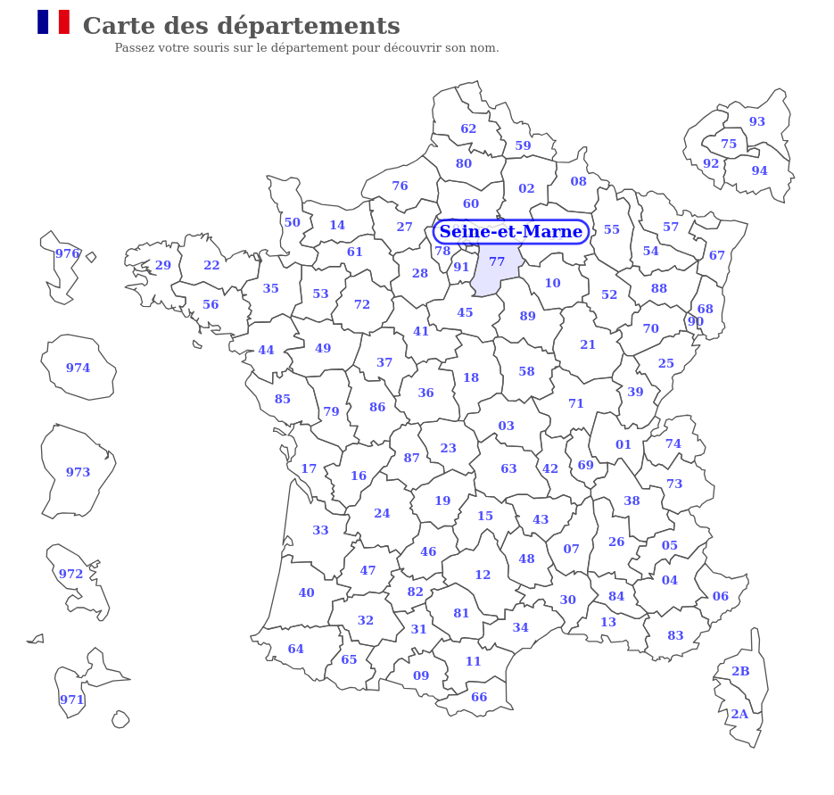

<h1 align="center">Carte de France et de ses départements</h1>

##### Carte interactive des départements français : passez votre souris sur les départements pour découvrir leur nom !

Live demo : [here](https://C-Vellen.github.io/Carte-de-France)

Technologies used : html, css, javascript